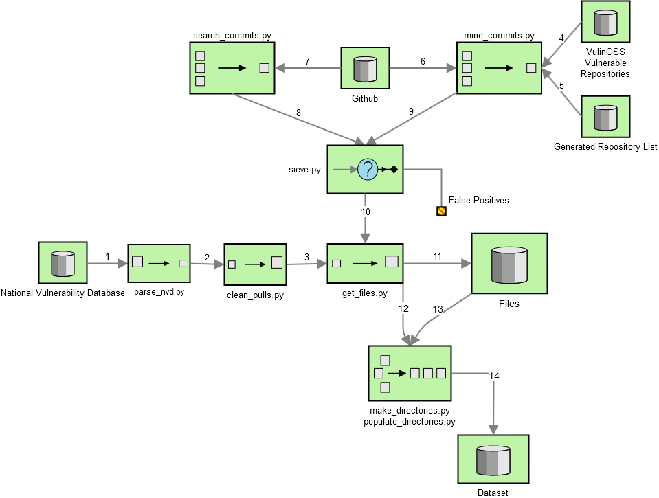

# Vulnerable Code Dataset

Follow the workflow chart and the script descriptions in order to either mine the NVD as is or find new vulnerabilities. 
<p align="center">

</p>
<p align="center">Workflow</p>

## To mine the National Vulnerability Database
### parse_nvd.py
- This script needs an nvd/ directory in the same subdirectory as the script containing all of the .json files from the NVD Database. The version of the schema it parses is 1.1

The parse_nvd.py file parses the nvd database and creates a semi-colon seperated csv file containing the CWE of the commit, the CVE ID and the commit link.

### clean_pulls.py
- This script requires the csv of github links parse_nvd.py created. 

The github links mined by parse_nvd.py contain pulls which contain many commits. This script flattens the pulls into commits. 
### get_files.py
- This script requires a files/ directory. Create the files/ directory with the command
    ```
    mkdir files
    ```
- This script requires the csv of github links clean_pulls.py created. (named commits.list) 

The get_files.py script creates a file_names.list file containing the file names of each file downloaded. 
The files downloaded end up on the files/ directory. They have the format of <good_or_bad>_<Vulnerability_ID>_<File_ID> 

### make_directories.py
- This script requires the file_names.list file made by get_files.py and the commits.list file created by clean_pulls.py
- This script requires the dataset/ directory in the same directory as the script. Create the dataset/ subdirectory with the command 
    ```
    mkdir dataset
    ```
This script creates the subdirectory tree required for the dataset 
The file_exts list contains the list of all ALLOWED file extensions. File extensions are filtered by this list 

### populate_files.py
- This script requires the file_names.list file made by get_files.py and the commits.list file created by clean_pulls.py
- This script requires the dataset/ directory formatted by the make_directories.py script. 
This script populates the subdirectory tree required for the dataset 
The file_exts list contains the list of all ALLOWED file extensions. File extensions are filtered by this list 

## To find your own vulnerable code
### mine_commits.py
This script mines commits from github. It receives a list (for the name reffer to list below) of repositories and searches commits with keywords. It then scores them based on the commit message.
Make sure to redirect the output to a file via the > operator. 
- In case the import of the CommitMiner class is: mine_commits_class_web_app
  The list of repositories is web_app.list from the assets/ directory.
  Also the script mines only web vulnerabilities (XSS, CSRF, SQLi)
- In case the import of the CommitMiner class is: mine_commits_class
  The list of repositories is highest_cve_rated_oss.list from the assets/ directory. This list is derived from the
  VulinOSS project. 
  In this case the script mines a multitude of vulnerability types. 
To make your own class of vulnerabilities to mine. Use the make_repo_list to make a repo file from already existing
commits and change the REPO_PATH 
### search_commits.py
This script uses the search Github API to create scored commit lists. It takes as an input keywords in the creation of the Commit_Response object.(In this version it also filters for PHP repositories) This script outputs a semi-colon seperated csv file (QUOTED). The name of this file is defined in the OUT_FILE parameter. The csv contains information about each commit. 
### sieve.py
This is a UI in which a researcher can sort out False Positives out of the commit list. Navigate through the commits using the i, j, k and l keys as arrow keys. Show the commit message by pressing the 'e' key. Show the coloured text by pressing the 'w' key. Quit by pressing the 'q' key. Add the commit to the True Positive list by pressing the 'a' key. Discard the commit by pressing the 'd' key. Add the commit to the False Positives list by pressing the 'f' key. For further review
of the commit press the 'c' key in order to copy the commit url to clipboard. 
The two center columns display the scores of the Random Forest model and the Neural Network model. The last column displays the CWE class of the commit. 
If the commit message is too long scroll with the j and k keys.

